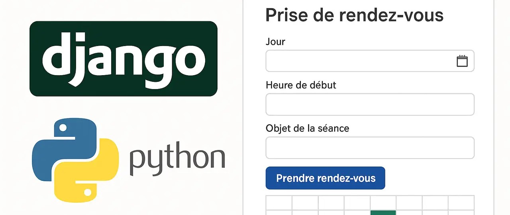
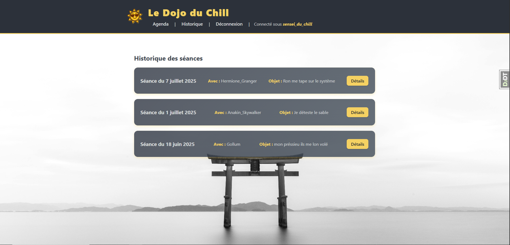
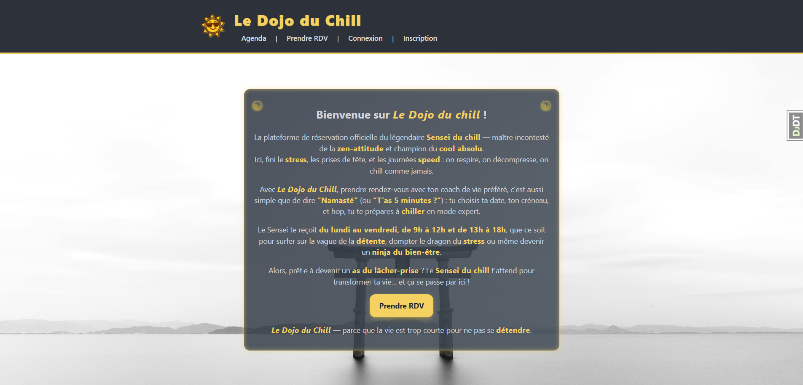
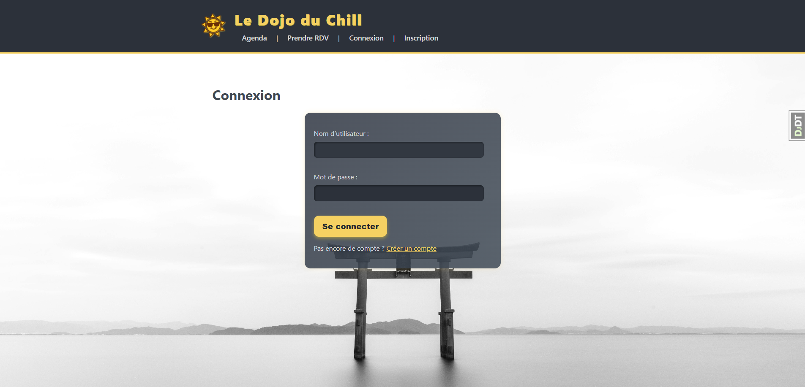
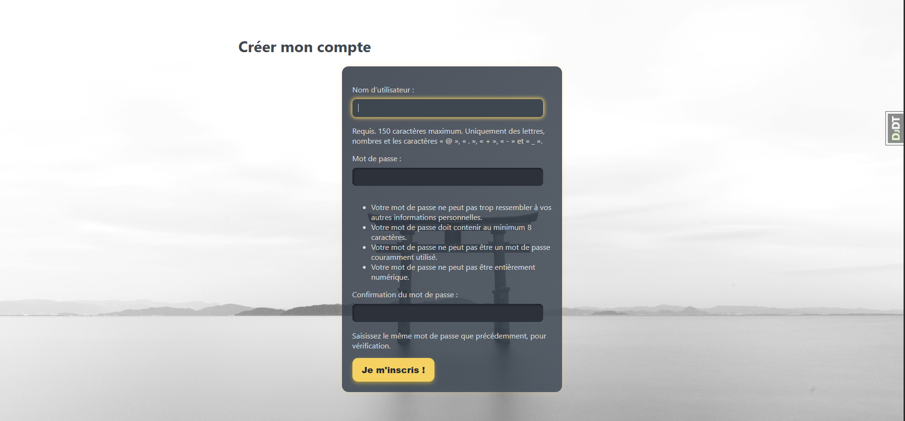
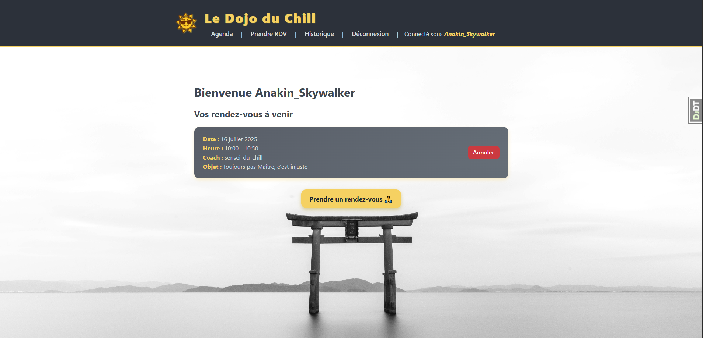
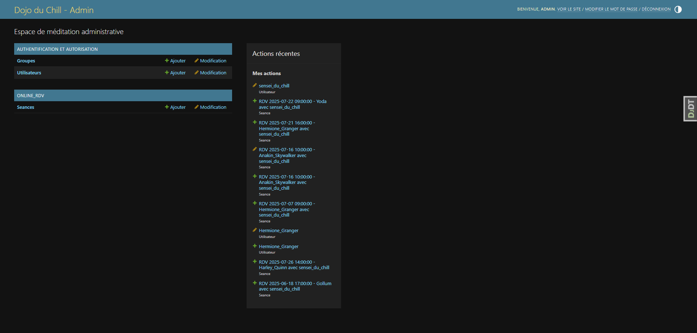

[](https://choosealicense.com/licenses/mit/)

# Le Dojo du Chill - application de prise de RDV pour un coach avec Django

**Contexte du projet** : 
Vous êtes sollicité pour développer une application web destinée à un coach en développement personnel. 
Ce coach souhaite offrir à ses clients un système simple, sécurisé et automatisé de prise de rendez-vous en ligne, avec un espace personnel. Votre mission consiste à réaliser cette application en **Python avec Django**, en vous appuyant sur les compétences acquises lors du tutoriel officiel.

Dans ce contexte, j'ai réalisé le **Dojo du Chill**. La plateforme inclut une interface dédiée pour les coachs, les clients, et une interface d'administration personnalisée pour les administrateurs.  



---

## Sommaire

- [Fonctionnalités](#fonctionnalités)
  - [Pour les clients](#pour-les-clients)
  - [Pour les coachs](#pour-les-coachs)
  - [Pour les administrateurs](#pour-les-administrateurs)
- [Technologies utilisées](#technologies-utilisées)
- [Installation locale](#installation-locale)
  - [Prérequis](#prérequis)
  - [Étapes](#étapes)
  - [Accès](#accès)
- [Structure du projet](#structure-du-projet)
- [Personnalisation](#personnalisation)
- [Screenshots](#screenshots)
- [Auteur](#auteur)
- [Licence](#licence)

------

## Fonctionnalités

### Pour les clients :
- Création de compte et authentification
- Prise de rendez-vous en ligne
- Visualisation des séances à venir
- Annulation de rendez-vous
- Visualisation des notes des séances précédentes


### Pour les coachs :
- Visualisation des rendez-vous planifiés
- Annulation de rendez-vous
- Création de notes personnelles sur les séances passées 

### Pour les administrateurs :
- Accès à l’interface d’administration Django
- Gestion des utilisateurs et des rendez-vous
- Personnalisation partielle de l’interface admin  


ℹ️ **Info** : Le projet est initialement développé pour un coach unique, mais un groupe *coach* dédié existe, permettant au superuser de définir plusieurs coachs. C'est pourquoi le formulaire de prise de RDV permet de sélectionner le coach souhaité.

---

## Technologies utilisées

- **Backend** : Django 4.x (Python 3.10+)
- **Base de données** : SQLite
- **Frontend** : HTML, CSS (stylisation personnalisée), JavaScript (comportements dynamiques simples)
- **Outils** : Virtualenv, Django admin, Django Debug Toolbar

---

## Installation locale

### Prérequis

- Python 3.10 ou supérieur
- Git
- Virtualenv (recommandé)

### Étapes

```bash
# 1. Cloner le dépôt
git clone https://github.com/Aurelien-L/coach_RDV.git

# 2. Créer un environnement virtuel
python -m venv venv
source venv/bin/activate  # Windows : venv\Scripts\activate

# 3. Installer les dépendances
pip install -r requirements.txt

# 4. Se placer dans le dossier rdv_with_coach
cd rdv_with_coach

# 4. Appliquer les migrations
python manage.py makemigrations
python manage.py migrate

# 5. Créer un superutilisateur
python manage.py createsuperuser

# 6. Lancer le serveur local
python manage.py runserver
```

### Accès
- Application : http://127.0.0.1:8000/

- Interface d’administration : http://127.0.0.1:8000/admin/


## Structure du projet

```
rdv_with_coach/
├── accounts/           # Gestion des utilisateurs (auth, profils, dashboard)
│   ├── admin.py
│   ├── apps.py
│   ├── context_processors.py
│   ├── forms.py
│   ├── models.py
│   ├── tests.py
│   ├── urls.py
│   ├── views.py
│   ├── migrations/
│   └── templates/
├── core/               # Pages générales (accueil, etc.)
│   ├── admin.py
│   ├── apps.py
│   ├── models.py
│   ├── tests.py
│   ├── urls.py
│   ├── views.py
│   ├── migrations/
│   └── templates/
├── online_rdv/         # Gestion des rendez-vous
│   ├── admin.py
│   ├── apps.py
│   ├── forms.py
│   ├── models.py
│   ├── tests.py
│   ├── urls.py
│   ├── views.py
│   ├── migrations/
│   ├── static/
│   └── templates/
├── rdv_with_coach/     # Configuration principale Django (settings, urls, wsgi, asgi)
│   ├── __init__.py
│   ├── asgi.py
│   ├── settings.py
│   ├── urls.py
│   └── wsgi.py
├── static/             # Fichiers statiques globaux (CSS, images)
├── templates/          # Templates globaux (base.html, etc.)
├── db.sqlite3          # Base de données SQLite
├── manage.py           # Commandes Django
└── requirements.txt    # Dépendances Python
```


## Personnalisation
- L’interface admin utilise des titres et en-têtes personnalisés.

- Interface différente selon coachs et clients (tableaux de bord distincts).

- Une séparation claire des responsabilités et des droits selon le groupe d’utilisateur (coach / client).

## Screenshots

Accueil client
  

Écran de connexion
  

Écran d'inscription


Agenda client


Interface administrateur


## Auteur

- [Aurélien L.](https://github.com/Aurelien-L) 


## Licence

Projet open-source sous licence MIT.